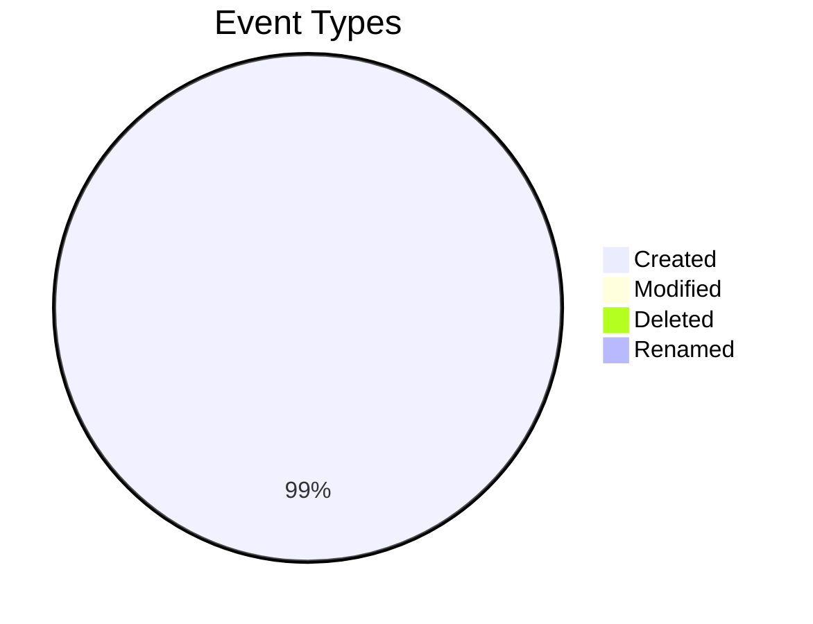
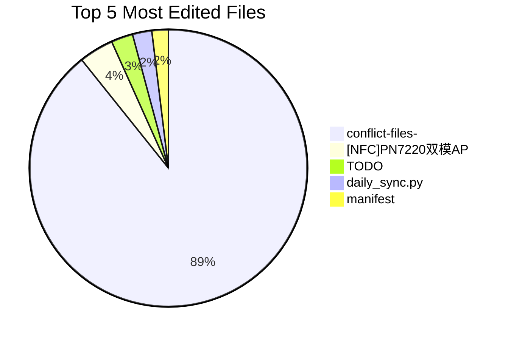
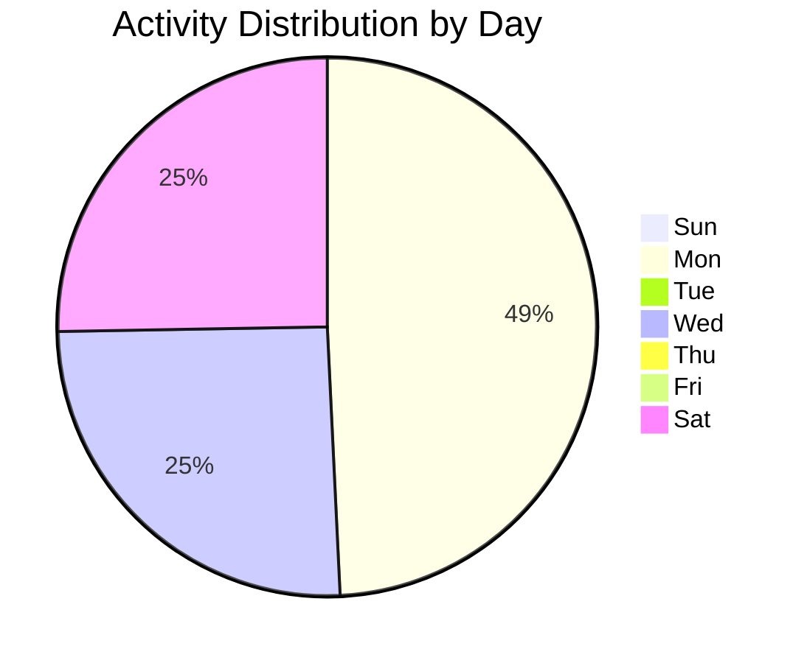
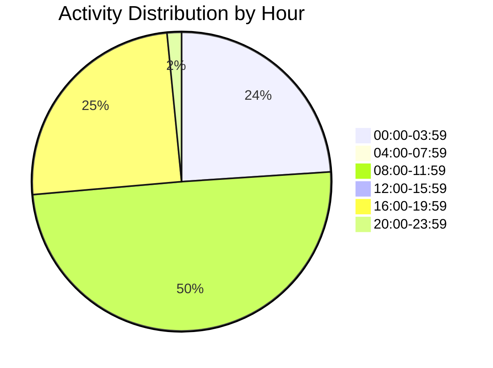
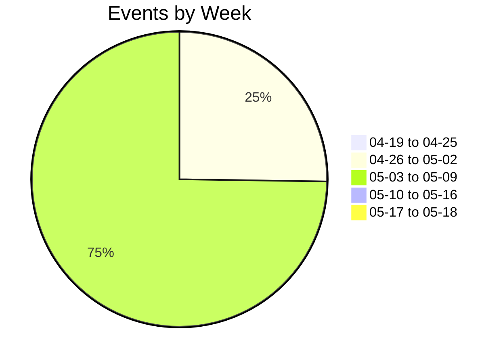
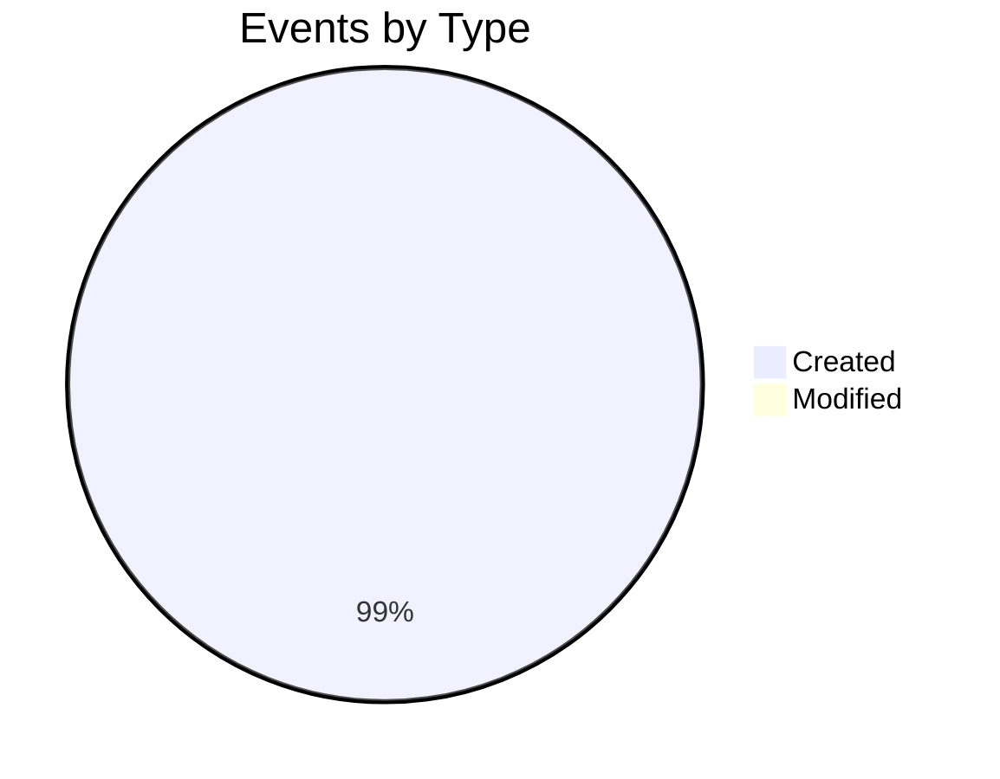
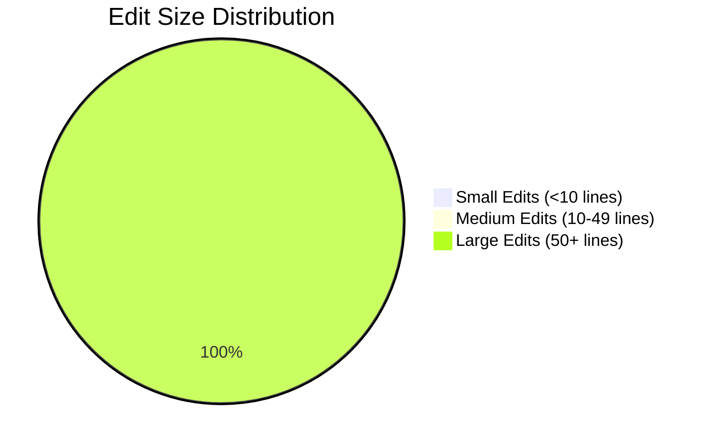

# 📊 Activity Dashboard

*Generated on 2026/5/18 at 10:22:07*

> [!button] Refresh Dashboard
> ```command
> daily-activity: Refresh dashboard
> ```

This dashboard provides visualizations and insights from your Obsidian activity data. Charts use Mermaid.js and are compatible with Obsidian's built-in rendering.

> [!NOTE]
> This dashboard is automatically generated by the Daily Activity plugin. Manual edits will be overwritten when the dashboard is updated.

> [!info] Activity Tracking Notice
> This dashboard is excluded from activity tracking. Any changes you make to this file will not affect your activity metrics.

> [!WARNING]
> You have enabled Charts plugin integration, but the Charts plugin is not installed or enabled. Install the "Obsidian Charts" plugin for enhanced visualizations.

---

# Activity Summary (Last 30 Days)

## Key Metrics

- **Total Events:** 7484
- **Unique Files:** 1858
- **Lines Added:** 3243466207
- **Lines Removed:** 11214
- **Net Change:** 3243454993 lines

## Event Breakdown



## Activity Snapshot

| Metric | Value |
|--------|-------|
| Most Active Day | Monday |
| Most Active Hour | 10:00-11:00 |
| Most Edited File | [[conflict-files-obsidian-git]] (1904 edits) |
| Average Daily Events | 249 |
| Average Edits Per File | 0 |

---

# Top Files Analysis

## Top 10 Most Edited Files

| File | Edits | Lines Added | Lines Removed |
|------|-------|-------------|---------------|
| [[conflict-files-obsidian-git]] | 1904 | 622281 | 566097 |
| [[[NFC]PN7220双模AP端调试]] | 86 | 4447348 | 91569 |
| [[TODO]] | 54 | 23045 | 705 |
| [[daily_sync.py]] | 48 | 1652637 | 82260 |
| [[manifest]] | 41 | 107023 | 78051 |
| [[[USB]USB逻辑调试]] | 40 | 673900 | 34597 |
| [[RepoScan_TODO]] | 37 | 326875 | 222431 |
| [[[Charger]USB状态不同步的问题]] | 35 | 807585 | 19845 |
| [[✅[Sensor][IMU]IAM20680调试记录]] | 32 | 1892736 | 0 |
| [[[Charger]USB状态不同步的问题]] | 30 | 1508132 | 0 |


## Top Files by Edit Count




---

# Time Distribution

## Activity by Day of Week



## Activity by Hour of Day



## Insights

You are primarily active on weekdays, especially on Mondays

You are most active during the morning (5AM-12PM) and least active during the evening (6PM-12AM)

---

# Activity Heatmap

```mermaid
flowchart TD
    title["Activity Heatmap (Day × Hour)"]
    note["Darker squares indicate more activity"]
    title --> note
    Sun["Sun"]
    Sun_Morning["Morning"]:::intensity0
    Sun --- Sun_Morning
    Sun_Afternoon["Afternoon"]:::intensity0
    Sun --- Sun_Afternoon
    Sun_Evening["Evening"]:::intensity3
    Sun --- Sun_Evening
    Sun_Night["Night"]:::intensity0
    Sun --- Sun_Night
    Mon["Mon"]
    Mon_Morning["Morning"]:::intensity0
    Mon --- Mon_Morning
    Mon_Afternoon["Afternoon"]:::intensity4
    Mon --- Mon_Afternoon
    Mon_Evening["Evening"]:::intensity3
    Mon --- Mon_Evening
    Mon_Night["Night"]:::intensity4
    Mon --- Mon_Night
    Tue["Tue"]
    Tue_Morning["Morning"]:::intensity0
    Tue --- Tue_Morning
    Tue_Afternoon["Afternoon"]:::intensity0
    Tue --- Tue_Afternoon
    Tue_Evening["Evening"]:::intensity3
    Tue --- Tue_Evening
    Tue_Night["Night"]:::intensity0
    Tue --- Tue_Night
    Wed["Wed"]
    Wed_Morning["Morning"]:::intensity4
    Wed --- Wed_Morning
    Wed_Afternoon["Afternoon"]:::intensity0
    Wed --- Wed_Afternoon
    Wed_Evening["Evening"]:::intensity4
    Wed --- Wed_Evening
    Wed_Night["Night"]:::intensity0
    Wed --- Wed_Night
    Thu["Thu"]
    Thu_Morning["Morning"]:::intensity0
    Thu --- Thu_Morning
    Thu_Afternoon["Afternoon"]:::intensity0
    Thu --- Thu_Afternoon
    Thu_Evening["Evening"]:::intensity3
    Thu --- Thu_Evening
    Thu_Night["Night"]:::intensity0
    Thu --- Thu_Night
    Fri["Fri"]
    Fri_Morning["Morning"]:::intensity0
    Fri --- Fri_Morning
    Fri_Afternoon["Afternoon"]:::intensity0
    Fri --- Fri_Afternoon
    Fri_Evening["Evening"]:::intensity3
    Fri --- Fri_Evening
    Fri_Night["Night"]:::intensity0
    Fri --- Fri_Night
    Sat["Sat"]
    Sat_Morning["Morning"]:::intensity4
    Sat --- Sat_Morning
    Sat_Afternoon["Afternoon"]:::intensity0
    Sat --- Sat_Afternoon
    Sat_Evening["Evening"]:::intensity4
    Sat --- Sat_Evening
    Sat_Night["Night"]:::intensity0
    Sat --- Sat_Night
    classDef intensity0 fill:#ffffff
    classDef intensity1 fill:#d3d3d3
    classDef intensity2 fill:#a9a9a9
    classDef intensity3 fill:#696969
    classDef intensity4 fill:#2f4f4f
```




---

# Activity Trends

## Activity Over Time



## Event Type Distribution



## Trend Analysis

- **Activity Trend:** Your activity has remained relatively stable over the last month
- **Peak Activity:** Your most active day was 2026-05-04 with 1858 events
- **Consistency:** Your activity pattern shows some gaps or inconsistency

---

# Writing Patterns

## Content Changes



| Metric | Value |
|--------|-------|
| Total Lines Added | 41302 |
| Total Lines Removed | 11214 |
| Average Lines Added per Edit | 960.5 |
| Average Lines Removed per Edit | 260.8 |

## Writing Style Analysis

- **Bulk Writer:** You often write large chunks of content at once, with significant additions.
- **Additive Writer:** You primarily add new content with minimal deletion of existing text.
- **Focused Sessions:** You tend to edit in less frequent but possibly more concentrated sessions.


